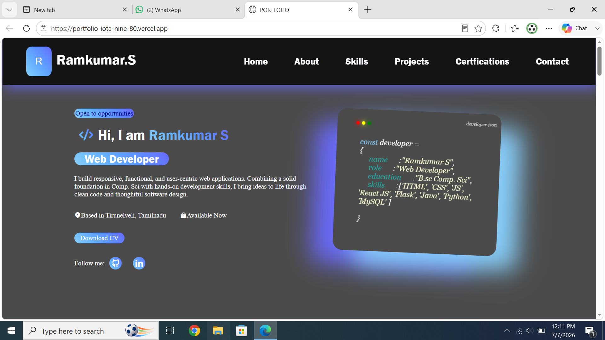
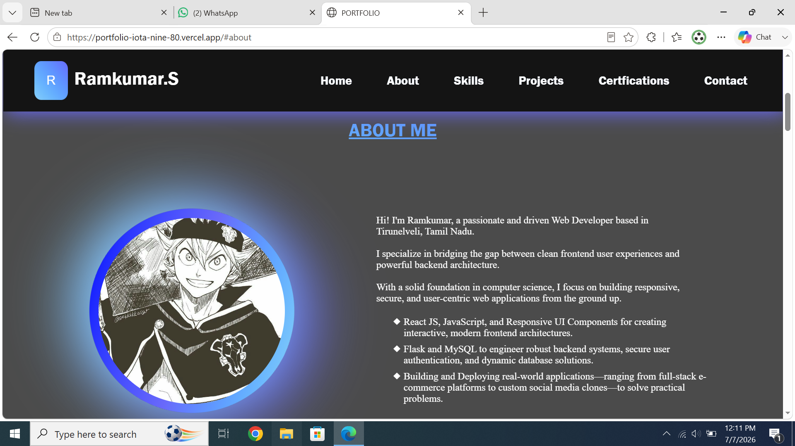
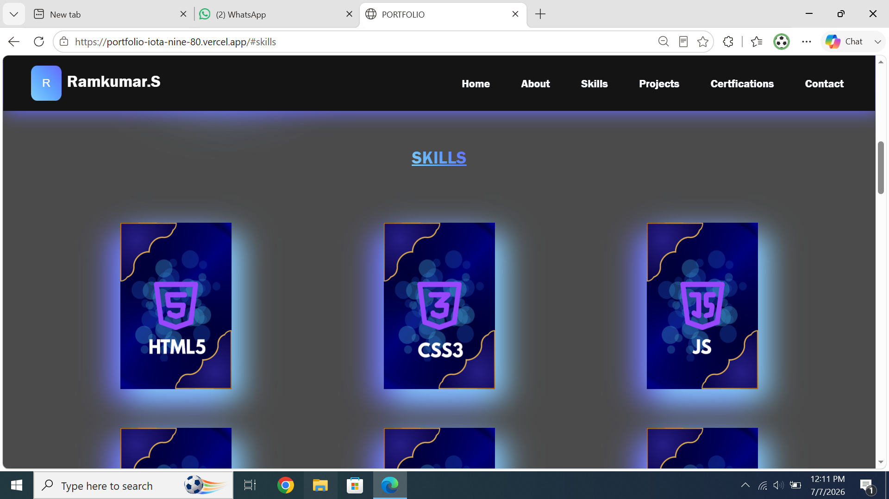
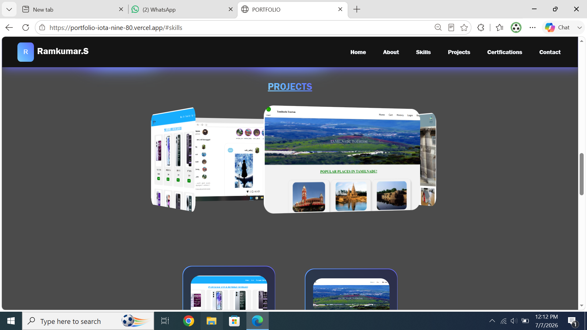
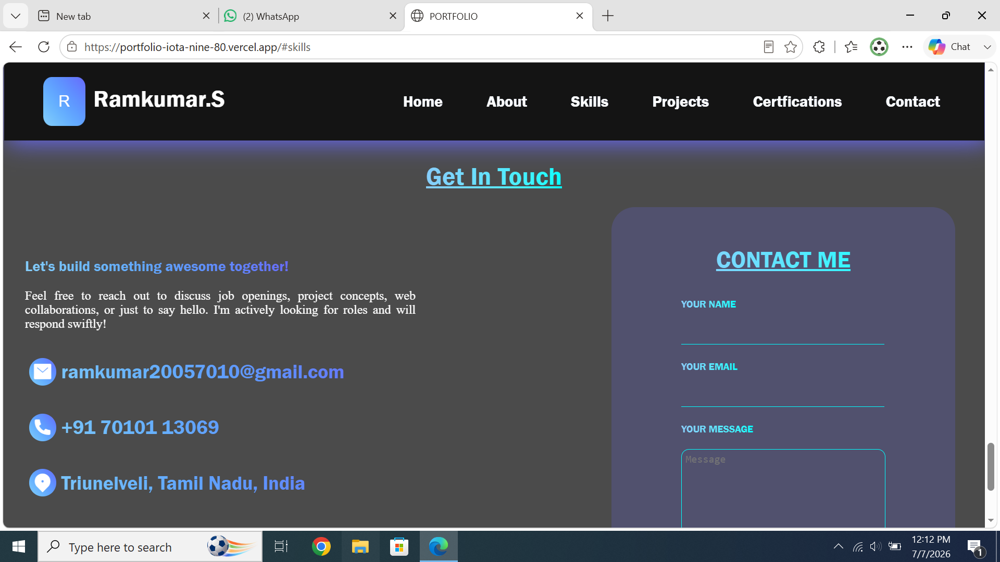

# Ramkumar.S - Personal Portfolio

A sleek, responsive, and modern personal portfolio website built with React.js.

## 🚀 Live Demo
[https://portfolio-iota-nine-80.vercel.app](https://portfolio-iota-nine-80.vercel.app)

---

## 📸 Screenshots

### Home Page

### About Me

### Skills

### Projects

### Contact Me

---

## 🛠 Features
- **Responsive Design:** Fully optimized for desktops, tablets, and mobile devices.
- **Modern UI:** Features a dark-themed aesthetic with neon/glowing accents.
- **Interactive Sections:**
    - **About Me:** Professional summary and introduction.
    - **Skills:** Visual representation of technical proficiencies.
    - **Projects:** Showcases recent work, including web applications like e-commerce platforms and social media clones.
    - **Contact:** Clean layout for showcasing contact details.
- **Deployment:** Fast and reliable hosting on Vercel.

## 💻 Tech Stack
- **Frontend:** React.js, HTML5, CSS3, JavaScript
- **Deployment:** Vercel

## 🤝 Contact
- **Email:** ramkumar20057010@gmail.com
- **Phone:** +91 70101 13069
- **Location:** Tirunelveli, Tamil Nadu, India

---
*Built with passion by Ramkumar S.*
